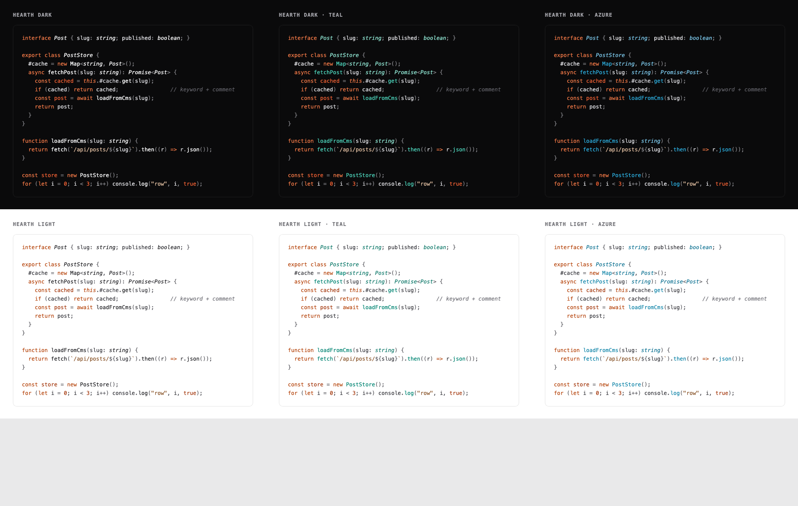

# Hearth

Hearth is a warm color theme for Visual Studio Code and Zed, with matching Warp
terminal themes. It includes six light and dark variants. Most of the interface
stays neutral, with orange, teal, or blue accents to make code easier to scan.



## Themes

- **Hearth Dark and Hearth Light** — mostly neutral syntax with orange accents.
- **Teal** — adds teal for functions and types.
- **Azure** — adds a brighter blue accent for functions and types.

## Install

### Visual Studio Code

Install [Hearth from the VS Code Marketplace](https://marketplace.visualstudio.com/items?itemName=RyanFurrer.hearth),
or search for **Hearth** in the VS Code Extensions panel.

After installing, open the color theme picker with `Cmd/Ctrl + K`, then
`Cmd/Ctrl + T`, and choose a Hearth theme.

### Zed

In Zed, run `zed: install dev extension` from the command palette and select the
repository's `zed/` directory. The six variants will appear in the theme
selector.

You can also copy `zed/themes/hearth.json` to Zed's local themes directory. On
macOS and Linux, that is `~/.config/zed/themes/`.

### Warp

Copy the six files in `warp/` to your Warp custom themes directory. On macOS:

```sh
mkdir -p ~/.warp/themes/hearth
cp warp/*.yaml ~/.warp/themes/hearth/
```

Restart Warp if it does not discover the new themes immediately. Teal and Azure
change the terminal's cyan pair; Warp does not expose editor syntax scopes.

## Shiki

The theme files in `themes/` can also be used directly with
[Shiki](https://shiki.style). Each file includes its VS Code theme name:

| Style | Light | Dark |
| ----- | ----- | ---- |
| Hearth | `hearth-light.json` | `hearth-dark.json` |
| Teal | `hearth-light-teal.json` | `hearth-dark-teal.json` |
| Azure | `hearth-light-azure.json` | `hearth-dark-azure.json` |

## Development

Run `npm run build` after changing either base theme or an accent value. The
build regenerates the accented VS Code themes, the Zed theme family, and all
Warp themes from the same source palettes.

## License

Hearth was made by [Ryan Furrer](https://ryanfurrer.com) and is available under
the [MIT License](./LICENSE.txt).
