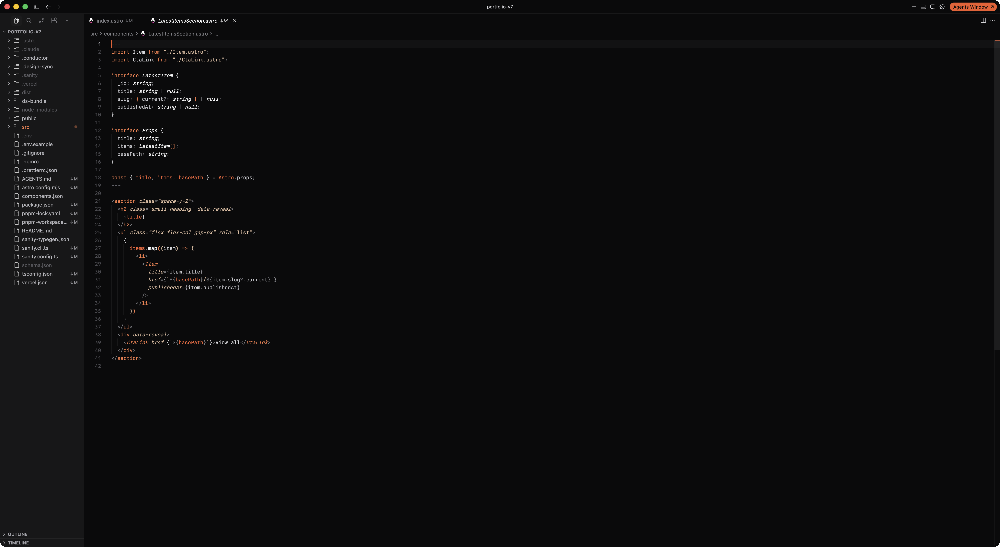
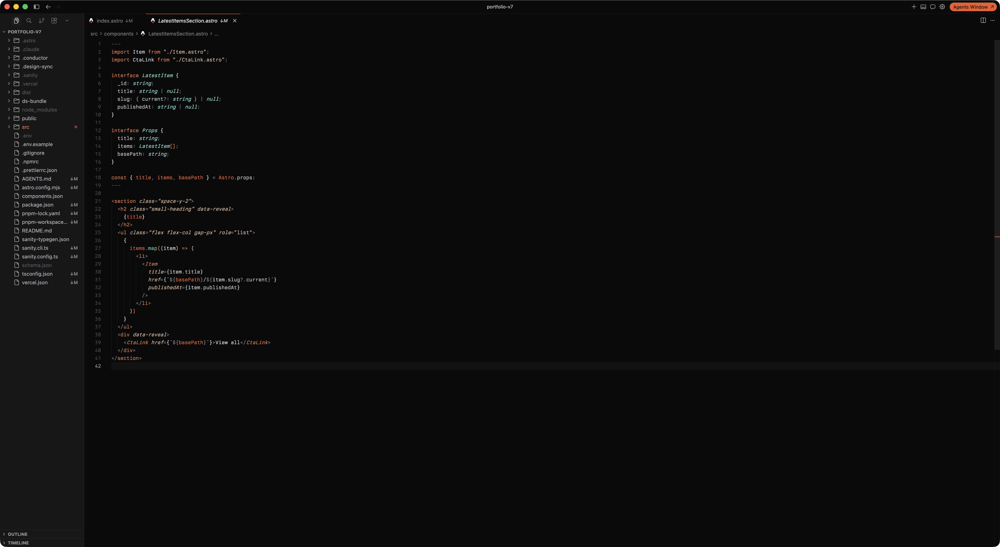
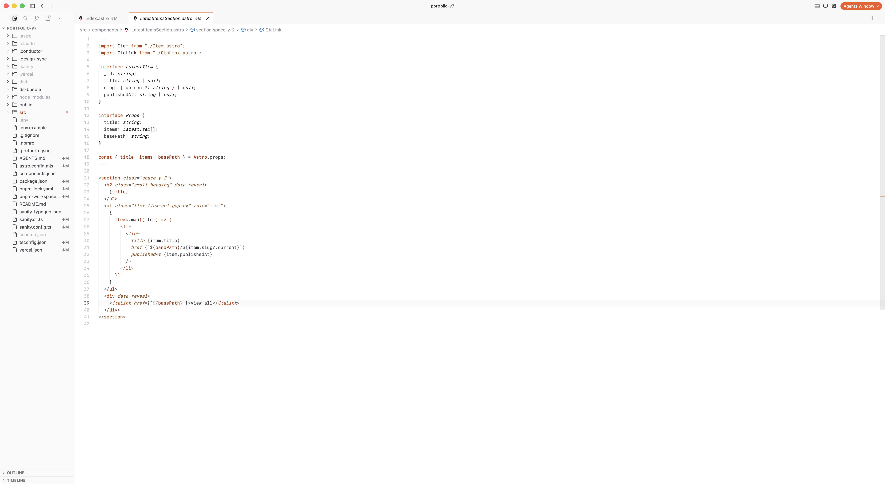
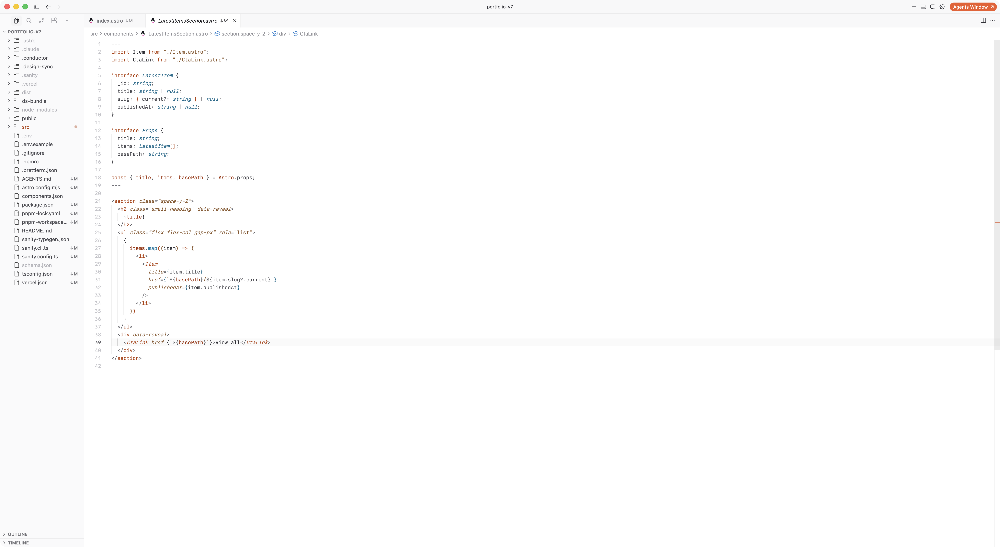
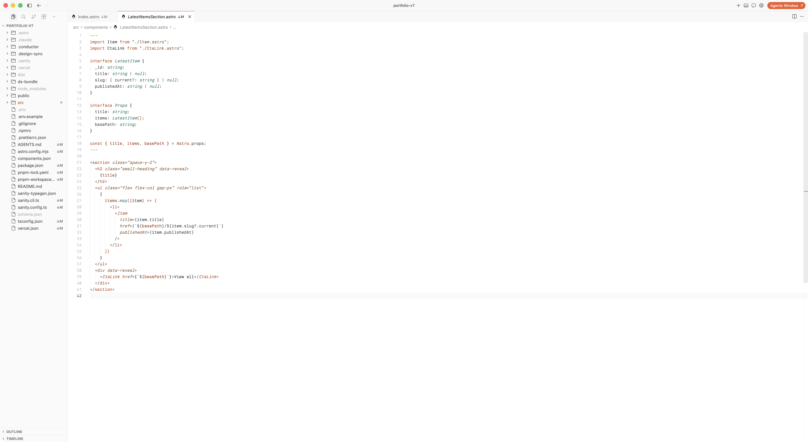

# Hearth

Hearth is a warm color theme that keeps the interface calm and lights the code
with a single ember. Six light and dark editor variants are available for VS
Code, Cursor, Zed, and Shiki; dedicated light and dark terminal themes are
available for Warp and Ghostty.

[Explore Hearth, compare every variant, and find installation instructions](https://hearth.ryanfurrer.com/).

Backgrounds, text, and comments stay in calm neutrals; the warmth lives in the
code. Keywords carry a single orange ember. Azure and Teal add one cool hue to
functions and types, so structure stands out without turning into a rainbow.

## Previews

### Hearth Dark



### Hearth Dark Azure


### Hearth Dark Teal



### Hearth Light



### Hearth Light Azure



### Hearth Light Teal



## Themes

- **Hearth Dark and Hearth Light** — duotone, with orange keywords and neutral
  functions and types.
- **Hearth Dark Azure and Hearth Light Azure** — the same base, with clear blue
  functions and a lighter tint on types.
- **Hearth Dark Teal and Hearth Light Teal** — the same base, with teal
  functions and a lighter tint on types.

The terminal palette keeps Hearth's warmth while giving every ANSI color a
distinct role: ember red, moss green, amber yellow, Azure blue, muted magenta,
and Teal cyan. All editor variants share this palette in their terminal.

## Install

### Visual Studio Code

Install [Hearth from the VS Code Marketplace](https://marketplace.visualstudio.com/items?itemName=RyanFurrer.hearth),
search for **Hearth** in the Extensions panel, or run:

```sh
code --install-extension RyanFurrer.hearth
```

After installing, open the color theme picker with `Cmd/Ctrl + K`, then
`Cmd/Ctrl + T`, and choose a Hearth theme.

### Cursor

Open Cursor's Extensions panel, search for **Hearth**, and click **Install**.

You can also find Hearth on
[Open VSX](https://open-vsx.org/extension/ryanfurrer/hearth/changes). To sideload
the extension instead, download
[hearth-latest.vsix](https://github.com/ryanfurrer/hearth-theme/releases/latest/download/hearth-latest.vsix),
choose **Install from VSIX…** from the Extensions panel's `…` menu, and select
the downloaded file.

After installing, open the color theme picker and choose a Hearth theme.

### Zed

Copy `zed/themes/hearth.json` to Zed's local themes directory. On macOS and
Linux, that is `~/.config/zed/themes/`. You can also run
`zed: install dev extension` from the command palette and select the
repository's `zed/` directory. All six variants will appear in the theme
selector.

A Zed extension-store listing is planned.

### Warp

Copy the two files in `warp/` to your Warp custom themes directory. On macOS:

```sh
mkdir -p ~/.warp/themes/hearth
cp warp/*.yaml ~/.warp/themes/hearth/
```

Restart Warp if it does not discover the new themes immediately. Warp does not
expose editor syntax scopes, so Hearth provides one complete ANSI palette in
light and dark modes. A listing in Warp's theme repository is in review.

### Ghostty

Copy the two files in `ghostty/` to Ghostty's custom themes directory:

```sh
mkdir -p ~/.config/ghostty/themes
cp ghostty/* ~/.config/ghostty/themes/
```

Then add one variant to `~/.config/ghostty/config.ghostty` (or `config` on
Ghostty versions before 1.2.3):

```ini
theme = hearth-dark
```

To follow the system appearance automatically, pair the corresponding light and
dark variants:

```ini
theme = dark:hearth-dark,light:hearth-light
```

Reload Ghostty with `Cmd/Ctrl + Shift + ,` after changing the theme.

## Shiki

The theme files in `themes/` can also be used directly with
[Shiki](https://shiki.style). Each file includes its VS Code theme name:

| Style | Light | Dark |
| ----- | ----- | ---- |
| Hearth | `hearth-light.json` | `hearth-dark.json` |
| Teal | `hearth-light-teal.json` | `hearth-dark-teal.json` |
| Azure | `hearth-light-azure.json` | `hearth-dark-azure.json` |

## Development

Run `npm run build` after changing either base theme or an accent value. The
build regenerates the accented VS Code themes, the Zed theme family, and the
light and dark Warp and Ghostty themes from the same source palettes.

Run `npm run package` to build the sideloadable VS Code extension as
`hearth-latest.vsix`.

Pushing a `v*` tag runs the release workflow. It verifies that the tag matches
the VS Code and Zed manifests, validates every generated theme, packages the
VSIX once, publishes it to GitHub Releases, the VS Code Marketplace, and Open
VSX, then triggers a fresh build of the Hearth landing page. The workflow can
also be rerun manually for an existing tag.

Maintainers configure `VSCE_PAT`, `OVSX_PAT`, and `PORTFOLIO_DEPLOY_HOOK` as
GitHub Actions secrets. The Marketplace credential will move from an Azure
DevOps PAT to Microsoft Entra workload identity before PAT retirement.

## License

Hearth was made by [Ryan Furrer](https://ryanfurrer.com) and is available under
the [MIT License](./LICENSE).
